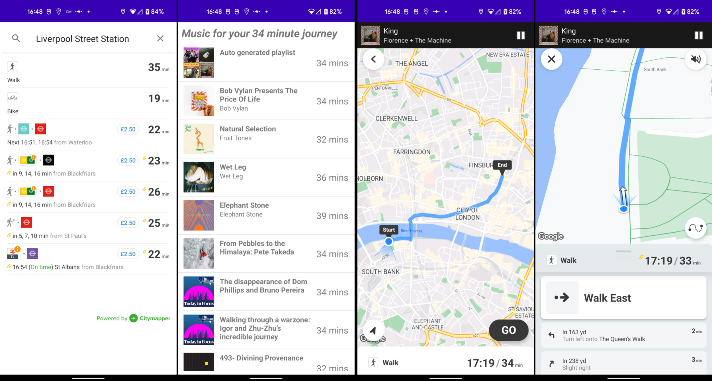
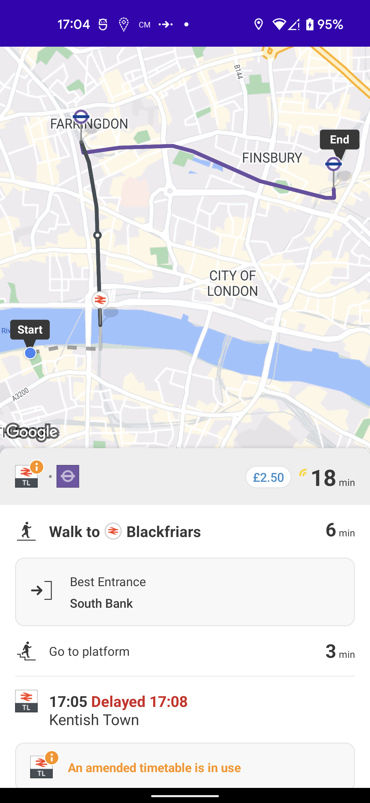

# Spotimapper

Spotimapper is an app which generates Spotify listening suggestions based on your journey. It was built as part of an internal hack-day in an engineering team here at Citymapper, and is intended to demonstrate the ease of integrating the Citymapper SDK UI components into a third-party app.

While the code here is intended as a demonstration the capabilities of the Citymapper SDK, it is far from a properly built Android app - in fact it was built by an engineer with minimal Android experience. As such, you should refer to [the official Citymapper SDK docs](https://docs.external.citymapper.com/) for up to date information on SDK usage.

Head to [citymapper.com/enterprise](https://citymapper.com/enterprise) to learn how you can integrate the Citymapper SDKs/APIs into your app!

## Usage



The screenshots above show a typical flow through the app.

The first screen allows you to search for a destination, and in the background the app will discover your location, and authorize Spotify usage - so on first use you will see a Spotify pop-up asking you to authorize various access to your Spotify account. Once you have searched for a destination, the app lists routes to that destination (provided by Citymapper).

Once you choose a route, the app will read your Spotify likes and choose some albums and podcasts that approximately fit the length of your journey, as well as generating a playlist of songs that matches your journey length. Your Spotify likes and saves are not saved in the app, and are not transmitted anywhere. The playlist generation uses the journey leg types to select high/low energy music for active/inactive legs of your journey!

You then select your music choice, the music starts playing immediately and you are presented with a navigation page - the navigation UI components are all provided by Citymapper. As well as the turn-by-turn navigation and voice instructions, there is a media control panel at the top of the screen. This shows you the currently playing song/podcast, and allows you to pause/play the track. You can also tap this box to jump straight to Spotify.

At the time of this apps creation, the navigation SDK is a work-in-progress, and as such the turn-by-turn navigation is not available for transit in the stable SDK. Transit journeys will instead present the journey plan page as pictured below.



## Building

Before building this project (in Android Studio or just with Gradle) you need to configure access to a number of APIs. Where keys are required they are configured in your `local.properties` file - this file will be generated when you first open the project in Android Studio.

**Citymapper**:

[Sign up for free access to the Citymapper APIs and SDKs here.](https://enterprise.citymapper.com/signup) You will be sent an API key which you can configure in the `local.properties` file like so:

```
CITYMAPPER_SDK_KEY=<Citymapper-API-key>
```

**Google Maps and Places**:

Follow [this guide](https://developers.google.com/maps/documentation/android-sdk/get-api-key) to setting up an API key for Google Maps SDK usage. You need access to the Maps and Places APIs, you will also need to set up billing for the places search fragment to work - see [this guide](https://developers.google.com/maps/documentation/places/android-sdk/cloud-setup). Once you have the API key add it to `local.properties`:

```
GOOGLE_MAPS_SDK_KEY=<Google-Maps-API-key>
```

**Spotify**

You will need a Spotify account. Head to [Spotify developer dashboard](https://developer.spotify.com/dashboard) and login. You then need to create an app and fill out some details - see [this guide to app setup](https://developer.spotify.com/documentation/general/guides/authorization/app-settings/). In the app settings: you will need to add `http://com.citymapper.spotimapper/callback` to the list of redirect URIs; you will need to add `com.citymapper.spotimapper` and the app SHA1 fingerprint in to the "Android Packages" section. You can generate the SHA1 fingerprint using the `gradle signingreport` command (this can be run in Android Studio: open the Gradle panel and click "Execute gradle task" and enter `signingreport`).

You will not need to add the API key into the app, but you will need to copy the client ID from the app dashboard into `local.properties`:

```
SPOTIFY_CLIENT_ID=<Spotify-Client-Id>
```

## How does the code work?

Please see the [Code-Guide](Code-Guide.md).
